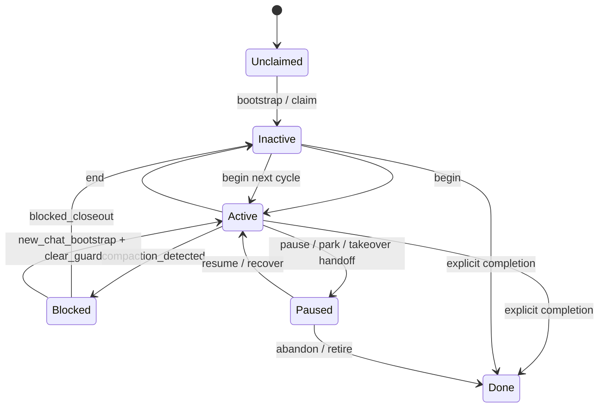

# Agent Lifecycle State Machine

Status: draft discussion document for the repo-local agent-cowork stack

This document is not a Mycel product roadmap item. It is a repo-local
coordination aid for discussing agent lifecycle, workcycle transitions, and
execution-policy behavior such as guard blocks and blocked closeout.

## Scope

This draft focuses on the current repo-local workflow around:

- registry lifecycle state
- work cycle begin/end
- guard-driven blocking
- mailbox handoff expectations
- blocked-closeout behavior

It is intentionally narrower than the full coordination docs. The goal is to
make state and transition discussion easier before we refine wording in the
canonical process docs or scripts.

## State Diagram

## State Intent

| State | Meaning | What it is for | What it is not |
|---|---|---|---|
| `Unclaimed` | No agent identity has been created yet. | Pre-bootstrap state. | Not a registry entry. |
| `Inactive` | The agent exists, but no work cycle is currently open. | Normal between-cycle resting state. | Not proof that the guard is clear. |
| `Active` | A work cycle is currently open. | Normal implementation / review / investigation work. | Not automatically safe to continue if compaction or another block is detected. |
| `Blocked` | Execution policy says the agent must not continue normal state-changing work. | Hard-stop for commit/push/normal end after compaction or similar guard reasons. | Not the canonical lifecycle state by itself; the registry still owns lifecycle truth. |
| `Paused` | Work is intentionally parked. | Recovery, takeover, or deferred continuation. | Not the same as stale-active or blocked. |
| `Done` | Work is explicitly finished or retired. | Terminal-ish state for completed or abandoned work. | Not just "inactive for now". |

## Transition Table

| Current State | Event | Guard / Condition | Next State | Side Effects | Reject? | Notes |
|---|---|---|---|---|---|---|
| `Unclaimed` | `bootstrap/claim` | role chosen and claim succeeds | `Inactive` | create registry entry, mailbox path, checklist copies | no | Fresh chat startup. |
| `Inactive` | `begin` | not blocked, begin succeeds | `Active` | registry touch/start, workcycle checklist, before-work line | no | Normal cycle start. |
| `Active` | `end` | not blocked, normal closeout path | `Inactive` | registry finish, checklist scan, mailbox validation, after-work line | no | Normal cycle completion. |
| `Active` | `compaction_detected` during `begin` | detector matches current thread / rollout | `Blocked` plus registry `Inactive` | create handoff, write guard block, abort normal begin | no | Current implementation writes the guard block and leaves the lifecycle inactive. |
| `Blocked` | `end` | no `--blocked-closeout` flag | rejected | none beyond error output | yes | Must not look like normal completion. |
| `Blocked` | `end --blocked-closeout` | agent is guard-blocked | `Inactive` | explicit blocked-closeout summary, mailbox diagnostics, after-work line | no | Non-normal closeout path. |
| `Blocked` | `agent_safe_commit` | blocked | `Blocked` | print blocked message | yes | Hard-stop on state-changing work. |
| `Blocked` | `agent_push` | blocked | `Blocked` | print blocked message | yes | Hard-stop on landing work. |
| `Active` | `pause/park` | explicit workflow decision | `Paused` | registry paused, mailbox handoff | no | Useful for takeover or intentional parking. |
| `Paused` | `resume/recover` | correct continuation flow | `Active` | read handoff, reopen work cycle | no | Resume path. |
| `Blocked` | `new_chat_bootstrap + clear_guard` | allowed recovery flow | `Active` or `Inactive` | new agent/bootstrap flow, possible guard clear | no | This remains partly future design; current first-pass guard does not yet implement clear. |
| `Active` / `Inactive` / `Paused` | `mark done` | work truly finished or retired | `Done` | registry done | no | Explicit completion, not just silence. |

## State Invariants

### `Active`

- A work cycle is open.
- Normal `end` should be allowed unless guard or other validation says otherwise.
- A same-role mailbox handoff is expected by closeout for non-bootstrap batches.

### `Inactive`

- No work cycle is open.
- A later `begin` is allowed.
- `Inactive` alone does not imply guard state is clear.

### `Blocked`

- `agent_safe_commit` must reject.
- `agent_push` must reject.
- Normal `end` must reject.
- `end --blocked-closeout` may succeed.
- The blocked reason should be explainable from persisted guard state.

### `Paused`

- Work is intentionally parked.
- Resume should rely on handoff/recovery context.
- `Paused` should not be treated as generic failure or stale-active by default.

### `Done`

- Normal work cycles should not continue without an explicit new claim or recovery decision.
- A `Done` agent is not just "inactive for now".

## Walkthrough: Compaction to Blocked Closeout

This is the most discussion-heavy path right now.

1. A normal chat is in `Inactive`.
2. `begin` is requested.
3. Compaction is detected from the current Codex session / rollout evidence.
4. The tool creates a mailbox handoff.
5. The tool writes guard state with reason `compact_context_detected`.
6. The registry is finished back to `Inactive`.
7. Any later normal `end` should reject because the agent is blocked.
8. `agent_safe_commit` and `agent_push` should also reject.
9. If we need explicit closure for the blocked thread, `end --blocked-closeout` is the non-normal closeout path.

The key design point is that:

- registry lifecycle truth and guard execution policy are related but separate
- blocked closeout is not the same thing as normal successful closeout

## Open Questions

1. Should `Blocked` remain only an execution-policy overlay, or should some guard reasons also map to a first-class registry status?
2. Should blocked closeout require a dedicated mailbox template instead of reusing the normal same-role handoff slot?
3. When `agent_guard.py clear` is added, which flows are allowed to clear a block: only fresh bootstrap, or explicit recover/takeover too?
4. Should some stale-active outcomes write guard state, or stay purely in the registry reconciliation layer?
5. Do we want a machine-readable transition table in JSON or YAML for test generation later?

## Recommended Discussion Workflow

When reviewing this state machine, use all three of these together:

1. the Mermaid state diagram for overall shape
2. the transition table for exact behavior and side effects
3. the invariants list for test design and bug finding

That combination is usually more useful than relying on only a diagram or only prose.
